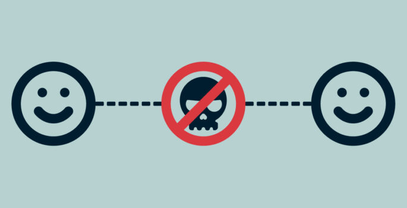

>Pour des raisons évidente de confidentialité je vais remplacer les éléments servant à reconnaitre l'app.

# Quel est le plan ?

- Reverse Engineering
- Instrumentation
- Attaque Man-in-the-middle

Je vais réaliser un travail de fond en effectuant un reverse engineering sur l'application android. Sans grande surprise l'app est obfusqué que ce soit au niveau du code managé que natif. L'utilisation de l'interropérabilité va compliquer l'apprentissage du système et l'interception de donnée.

En ce qui concerne l'instrumentation nous allons utiliser le framework **Frida**.

Enfin, on fera une attaque man-in-the-middle une fois la logique SSL altéré.

### Réseau
Afin d'être en mesure d'intercepter le trafic web https, il faut pour cela avoir setup :
- Téléphone Android (9>=)
    - Rooté et moddé
    - Proxy système (via iptable) -> Proxydroid
- PC
    - mitmproxy

### Reverse Engineering

En analysant l'app je constate plusieurs éléments intéressant.
#### Dalvik
En ce qui concerne la partie code virtualisé par la VM dalvik, on remarque que l'app est `packé` et `obfusqué`. On va chercher a `recover` la partie du code manquante afin d'avoir toutes les classes.

On cherche rapidement quels sont les intéractions avec les librairies natives. Initialement l'utilisation de code natif sert à des fins de performances, d'autres s'en servent pour avoir une couche supplémentaire de sécurité. 
> La décompilation de code virtualisé et natif n'a absolument rien avoir.
{: .prompt-warning}

#### Native
##### VM Obfuscation (boite noire)

En ce qui concerne la partie native, nous avons deux librairies qui m'ont intrigué, `libencrypt.so` et `libdexjni.so`, toutes deux en architecture ARMv8a (arm x64).

A priori, `libencrypt.so` aurait le rôle d'une classe utile de chiffrement symétrique en mode whitebox.

> Le mode whitebox d'une classe de chiffrement, ici symétrique, est le fait d'immplémenter d'une façon non conventionnelle le code afin de ne pas pouvoir être en mesure d'avoir la clé de chiffrement utilisé `facilement`. Cette implémentation doit résister à un environnement dit `hostile` et/ou non sécurisé.
{: .prompt-info}

A propos de `libdexjni.so`, cette lib aurait le rôle selon moi de machine virtuelle ou boite noire. 

Exemple: 

```java
// original fct, don't exist in code
public void test() {
    log.info("hello");
}

// -----

// native abstract fct 
public native void V(int i);

// how it's used in obfuscated code
public a(String s, int a, Long l) {
    // ...

    // V() is the fct that handle a void using no parameters.
    // test() will be call like this. 
    // We have to find the right number to the right fct association.

    // V() native abstract fct call libdexjni.so lib containing V() implementation.
    V(1549);
    // ...
}
```

Voici un moyen d'appeler du code via une fonction `relay` et qui finira sa course dans du code natif.

##### Chiffrement symétrique en boite blanche

Concentrons nous à regarder les méthodes JNI de la librairie native `libencrypt.so`, nous tombons sur ces deux fonctions :
- Java_com_**bangcle**_comapiprotect_CheckCodeUtil\_**checkcode**
- Java_com_**bangcle**_comapiprotect_CheckCodeUtil\_**decheckcode**

Elles utilisent la solution de sécurité de l'obfuscateur Bangcle qui met à disposition des implémentations de chiffrement whitebox à disposition. La lib en question est rempli de technique de sécurité telle que l'anti debug, anti tamper. On l'observe dans un outil comme Ghidra, 80% de la lib est illisible en tant qu'instructions ARCH64.

> Pour information, **Bangcle** est une solution de sécurité mobile (obfuscateur) commercial chinois réputé pour être très difficile à reverse.
{: .prompt-tip}


### Instrumentation

Afin de monitorer l'activité de ces deux methodes JNI, `checkcode` et `decheckcode`, nous allons hook le chargeur de librairie (Dalvik) afin de pouvoir hook les appels vers ces methodes.

Exemple plus simplifié sans le premier hook :

```js
Interceptor.attach(Module.getExportByName('libencrypt.so', 'Java_com_bangcle_comapiprotect_CheckCodeUtil_checkcode'), {
    onEnter: function(args) {
      console.log(args)
    },
    onLeave: function(retval) {
      var aes_value = Java.vm.getEnv().getStringUtfChars(retval, null).readCString()
      console.log(aes_value)
    //   retval.replace(0);
    }
});

Interceptor.attach(Module.getExportByName('libencrypt.so', 'Java_com_bangcle_comapiprotect_CheckCodeUtil_decheckcode'), {
    onEnter: function(args) {
      console.log(args)
    },
    onLeave: function(retval) {
      var aes_value = Java.vm.getEnv().getStringUtfChars(retval, null).readCString()
      console.log(aes_value)
    //   retval.replace(0);
    }
});
```

Cette ensemble d'instructions `Java.vm.getEnv().getStringUtfChars(retval, null).readCString()` nous permet de lire un tableau d'octets qu'on aurait encodé en UTF8 puis lu comme en C : `c_str()`.

> **c_str()** : Get C string equivalent.
>
>Returns a pointer to an array that contains a null-terminated sequence of characters (i.e., a C-string) representing the current value of the string object.
{: .prompt-tip}

___

<center style="font-size: 25px">
WORK IN PROGRESS - TO DO CONTINUE.
</center>